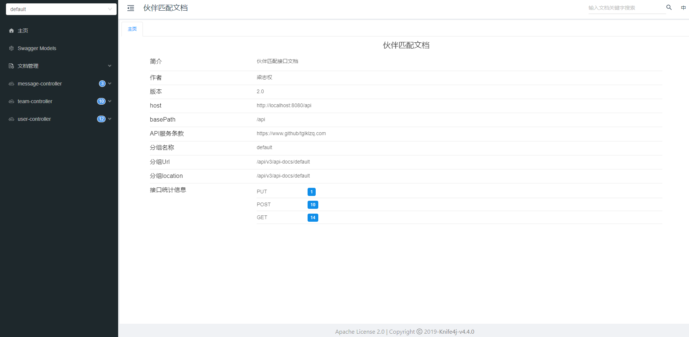

此为伙伴匹配系统的后端代码，包含后端接口，数据库，以及后端的代码。
前端代码：https://github.com/tglklzq/PartnerMatch-frontend
### 1.技术要点
* SpringBoot 框架
* MySQL数据库
* Redis缓存
* MyBatis-Plus
* Swagger + Knife4j 接口文档
* WebSocket
* Redisson 分布式锁 (用于解决加入组队的并发问题)
* GSON 解析json tags
* jUnit 单元测试库
#### 2.后端接口文档：
使用knife4j+swagger2生成接口文档，文档地址：http://localhost:8080/api/doc.html#/

## 关于设计问题
### 匹配伙伴：
#### 1.普通匹配
* 随机匹配：随机提取一个标签进行随机匹配。

后续可能额外添加限定

#### 2.关于精准匹配
* 编辑距离：适合文本字符串的精确匹配。如果你的标签数据是非常短的字符串，并且你关心每个字符的匹配情况，可以选择编辑距离。
* Jaccard相似度：适合用于比较两个标签集合的相似性，是标签匹配的首选方法。
* 余弦相似度：适合用于文本向量的比较.
* 这里额外设置了IP地址或域名的匹配，后续可改为地理距离，以约束范围，其信息获取在：  http://whois.pconline.com.cn/ipJson.jsp

#### 3.关于用户聊天约束
* 目前我仅设计在线的用户之间可通信，未设计离线用户之间的通信。鼓励用户要有实时性的沟通。后续可考虑设计离线用户之间的通信，但需要考虑用户隐私问题。
设计思路可以将消息存储在队列中，等用户上线后再发送。
* 聊天内容，尚未考虑敏感词过滤，后续可考虑添加敏感词过滤。设计思路可以将敏感词存储在数据库中，并定期更新。

#### 4.关于用户注册
* 关于用户注册的并发问题，我尚未使用分布式锁，后续可考虑添加分布式锁，以解决并发问题，比如多人同时注册同一个用户名。
* 后续将考虑使用用户邮箱进行注册

#### 5.用户ID问题
* 目前使用的是以1为起始，递增的ID，连续的ID涉及到安全问题，后续可考虑使用UUID，雪花算法等。

